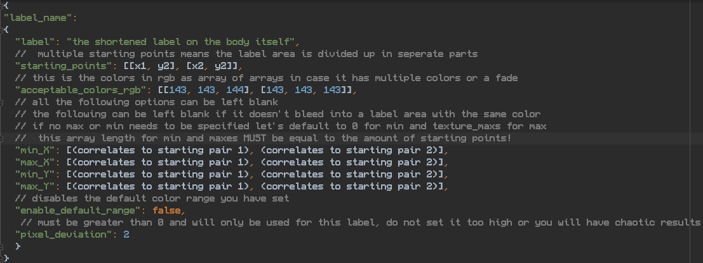

This can convert a texture map label to a 3D geometry object based on the object it is laid upon. Assuming the original
model has a UV map. The main script is Run_all.py.

Begin with creating the geometry files.
Template for geometry_faces.json is:

`{
"faces":
[
{
"a": [
0.03394199162721634,
1.8512920141220093,
0.12994499504566193
],
"b": [
0.034543998539447784,
1.851457953453064,
0.1297769993543625
],
"c": [
0.03403998911380768,
1.851897954940796,
0.12925300002098083
]
}...,
]}`

Where a,b, c are the 3 vertices that make up a face.

Geometry_normals.json follows the same pattern except it's using the
normal vertices.

Geometry uvs follows a similar pattern. Except there are x, y keys used.

`"uvs":
[
{
"a": {
"x": 0.659850001335144,
"y": 0.10572999715805054
},
"b": {
"x": 0.6620399951934814,
"y": 0.10736999660730362
},
"c": {
"x": 0.6562100052833557,
"y": 0.1057400032877922
}
},...
]`

PixelGrabber.py reads in from the muscle_starts.json file and finds all pixels that match (in diffuse.jpg) the
acceptable colors
parameter given starting points via depth first search.

PixelToFace is by far the most intensive, and returns what faces the texture pixel belongs to. It begins by loading in
all the geometry files. It then decomposes each
triangle into a series of points that are on or within the triangle. This takes a long time but only needs to be run
once! Subsequent runs are much faster. So comment in or out pixel_to_faces.decompose_all_triangles() in Run_all.py to
disable or enable.

PixelIndexer reads in what PixelToFace finds (the faces) and formats and removes repeats and ultimately creates the .obj
file.

For specific runs you can run for specific muscles given a list of names.
You can also enable/disable specific scripts by changing the boolean statements to False or True.
